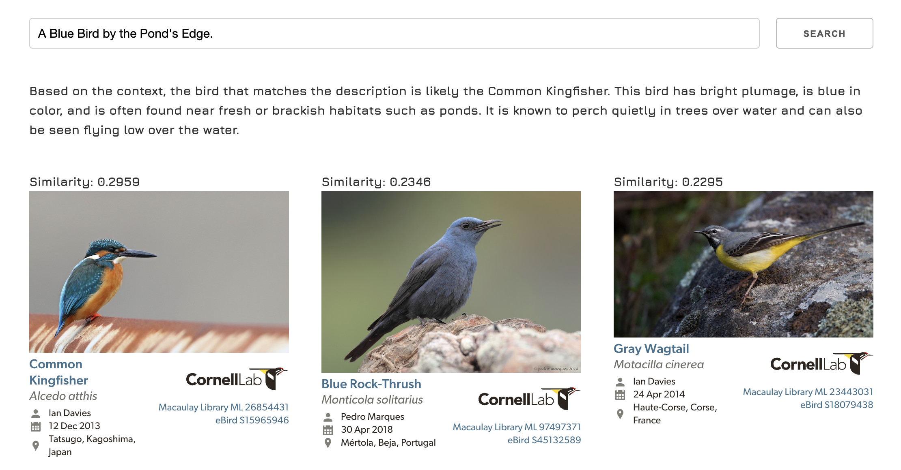
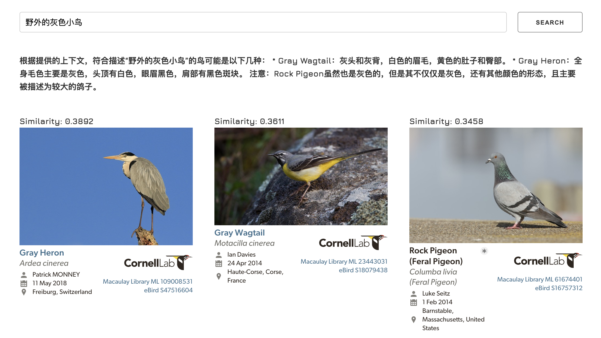

## **RAG-eBird**

A Retrieval-Augmented Generation(RAG) project for bird searching.
Workshop of Lecture LAH. C654.

## **Introduction**

This project aims to find specie name through user inputted identification words like:
Red(color), Tiny(body type), Shallow Wetland(living place), etc.

Or you can directly type nature language such as: "I found a group of red small birds on the street."
After pressing 'SEARCH', the app will show you most related bird species.

### **Tools and data source:**

1. Large Language Model (LLM): meta/llama-3.1-70b-instruct
2. Embedding Model: nvidia/llama-3.2-nv-embedqa-1b-v1
3. Vector Database: Chroma DB
4. Frontend: Plotly Dash
5. Data Source: <https://ebird.org/>

### **Screenshot**

<!-- 

Alcedo atthis (カワセミ)

This media is sourced from the [Macaulay Library](https://macaulaylibrary.org/asset/26854431).
© Cornell Lab of Ornithology, Macaulay Library. -->

## **Installation and Usage**

To install **RAG-eBird**, follow these steps:

1. Clone the repository:  
   `git clone https://github.com/elechou/RAG_eBird.git`

2. Navigate to the project directory:  
   `cd <repository-directory>`

3. Install required packages:  
   `pip install -r requirements.txt`

4. Start the project:  
   `python RAG-eBird-frontend.py`

5. Open the web app:  
   [http://localhost:8050/](http://localhost:8050/)

## **Database Creating**

You can choose non-database deployment or a Chroma DB deployment.
Non-databases can be run directly in Jupyter Notebook.
There are two examples in the root folder.

An embedding database can speed up the app loading time,
since a non-database project needs to encode embedding documents each time.

Steps to create your own database:

1. **Fetch your bird data**

    You can find bird lists in eBird, here is an example:

    [https://ebird.org/region/JP-13/bird-list?rank=hc](https://ebird.org/region/JP-13/bird-list?rank=hc)

    Change the city name you are interested in. Then copy the link to the `url` in
    [scrape_ebird_list.ipynb](scrape_ebird_list.ipynb).
    Run this Jupyter Notebook, a JSON file will be created.

    ([./source/ebird_data.json](./source/ebird_data.json) is a scraped example. Can be used directly.)

2. **Embedding bird identification info to database**

    Use [chroma_db_creator.ipynb](chroma_db_creator.ipynb) to analysis the mentioned JSON file.
    And save the embedded object as an embedding database(Chroma DB).

    ([./chroma_db/chroma_db.sqlite3](./chroma_db/chroma_db.sqlite3) is an embedded example. Can be used directly.)

<!-- ## **Contributing**

If you'd like to contribute to Project Title, here are some guidelines:

1. Fork the repository.
2. Create a new branch for your changes.
3. Make your changes.
4. Write tests to cover your changes.
5. Run the tests to ensure they pass.
6. Commit your changes.
7. Push your changes to your forked repository.
8. Submit a pull request. -->

<!-- 
## **Code of Conduct**

Please note that this project is released with a Contributor Code of Conduct. By participating in this project, you agree to abide by its terms. See the **[CODE_OF_CONDUCT.md](https://www.blackbox.ai/share/CODE_OF_CONDUCT.md)** file for more information. -->

## **FAQ**

**Q:**
> What kind of machines can this project be deployed on?

**A:**
> This project requires at least 16 GB of RAM to run `dunzhang/stella_en_1.5B_v5` properly.

**Q:**
> It is too slow to open this app **at the first time**.

**A:**
> This project uses `dunzhang/stella_en_1.5B_v5` to analysis user inputted text.
> At the first time loading this app, `dunzhang/stella_en_1.5B_v5` needs to be downloaded in to your local machine,
> which is quite heavy (about 6.2 GB). You can choose other LLM depends on your needs, however,
> if you changed to another LLM, you need to create your own database following **Database Creating**.
> Because the default database ([chroma_db.sqlite3](./chroma_db/chroma.sqlite3)) is created by `dunzhang/stella_en_1.5B_v5`.  
>`intfloat/multilingual-e5-large` is also tested in this project, which requires less RAM/Memory,
> but accuracy is relatively low.

## **Change log**

- **0.1.1(Nov.4 2024):** Added API version app, enabled RAG function.
- **0.1.0(Nov.2 2024):** Initial release

## **License**

**RAG-eBird** is released under the MIT License. See the LICENSE file for details.

## **Authors and Acknowledgment**

**RAG-eBird** was created by **[Shou Qiu](https://github.com/elechou)**.

<!-- Additional contributors include:

- **[Contributor Name](https://github.com/contributor-name)**
- **[Another Contributor](https://github.com/another-contributor)**
Thank you to all the contributors for their hard work and dedication to the project. -->

## **Contact**

If you have any questions or comments about **RAG-eBird**, please contact Shou Qiu (<qiusots@gmail.com>).
